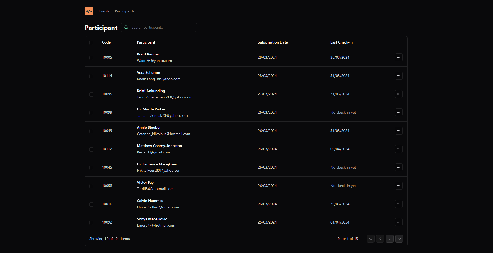
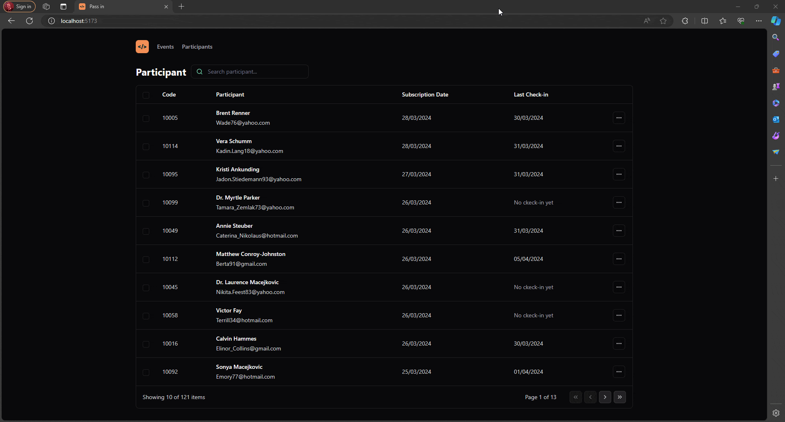

[](https://github.com/ikaroamorim/pass-in-web/commits/master)

[](https://github.com/ikaroamorim/pass-in-web/stargazers)

# Pass in (Web)

## Table of Contents

- [Pass in (Web)](#pass-in-web)
  - [Table of Contents](#table-of-contents)
  - [Description](#description)
  - [Installation](#installation)
    - [Pre-requisites](#pre-requisites)
    - [Local Installation](#local-installation)
    - [Serve back-end locally](#serve-back-end-locally)
  - [Usage](#usage)
  - [Contributing](#contributing)
    - [How to Contribute](#how-to-contribute)
  - [Author](#author)
  - [Images](#images)


## Description 
Pass in is a application made in the Nlw Unite event, promoted by [Rockectseat](https://www.rocketseat.com.br/).
It consists in a app for managing subscriptions of event attendees it teaches core concepts of single React page application development and consuming data from external API
It uses concepts of pagination and search, and persists on url the state of pagination and search


## Installation

### Pre-requisites

Before locally install the project you`ll need install the following pre requisites:
- [Git](https://git-scm.com)
- [Node 20.11.1+](https://nodejs.org/en/)

### Local Installation

```bash
# clone the repository
$ git clone https://github.com/ikaroamorim/pass-in-web.git

# navigate to folder
$ cd pass-in-web

# install dependencies
$ npm install

# run the project
$ npm run dev
```

### Serve back-end locally

This project depends a backend that can be found Rocketseat repo:
```bash
# clone the repository
$ git clone https://github.com/rocketseat-education/nlw-unite-nodejs

# navigate to folder
$ cd nlw-unite-nodejs

# create a .env file with the following content
DATABASE_URL="file:./dev.db"

# install dependencies
$ npm install

# create databese seed
$ npx prisma db seed

# run project
$ npm run dev
```

## Usage

This project is more for practising a development than to be a useful so feel free to use it as desired.

## Contributing

Thank you for considering contributing to this project! Contributions are welcome and encouraged. You can contribute in various ways, including but not limited to:

- Reporting bugs
- Discussing new features or enhancements
- Writing code patches
- Improving documentation
- Providing feedback

### How to Contribute

1. **Fork** the repository to your GitHub account.
2. **Clone** the forked repository to your local machine.
3. **Create a new branch** for your contribution:
  ```bash
   $ git checkout -b feature/new-feature
  ```
4. **Make** your changes and ensure they adhere to the project's guidelines and coding standards.
5. **Commit** your changes with a descriptive commit message:
  ```bash
  $ git commit -am 'Add new feature: description of your changes'
  ```
6. **Push** your changes to your fork:
  ```bash
  $ git push origin feature/new-feature
  ```
7. **Submit** a pull request (PR) to the original repository. Ensure you provide a clear and descriptive title and description for your PR. Include any relevant details that would help reviewers understand your changes.


## Author
<a href="https://www.linkedin.com/in/ikaroamorimesilva/">
 
 <br />
 <sub><b>Ikaro Amorim e Silva</b></sub>
 </a>

Done with ❤️ by Ikaro Amorim e Silva

[](https://twitter.com/ikaroamorim) [](https://www.linkedin.com/in/ikaroamorimesilva/) 
[](mailto:ikaro.amorim@gmail.com)

## Images

<p align="center">
   
</p>

<p align="center">
   
</p>

